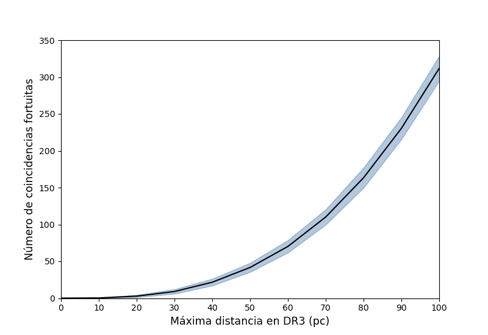

# Simulation of False Positives for Image-Based Method (Part of Thesis Work)

## Objective:
This project aims to simulate the likelihood of false positives in an image-based method used to search for radio-emitting stars. The method involves randomizing star positions within the irregular observation areas of the FIRST radio survey to estimate how often false positives may occur due to chance alignments of stars with apparent radio sources.

## Methodology:
- **Data Source**: The study uses observations from Gaia DR3 and the FIRST catalog.
- **Simulations**: A total of 1.5 million random observations were generated by randomizing the positions of 76,261 stars observed in Gaia DR3.
- **Web Scraping**: An extensive web scraping process was used to retrieve the cutouts for each observation. This step required making over 1.5 million requests to the FIRST cutout service, an immense task that provided the necessary data to simulate the search for radio-emitting stars.
- **False Positive Estimation**: Using a binomial distribution, the number of false positives was estimated across several distance ranges, from 10 to 100 parsecs. The number of expected false positives was calculated and represented graphically to help evaluate the method's performance.

## Results:
- **False Positives**: Out of 1,308,354 random observations, 5,174 resulted as false positives based on the criteria for a radio source used in the catalog method.
- **Expected False Positives**: The number of expected false positives increases significantly with distance. Up to 100 pc, between 300 and 350 false positives were expected, which presents a major challenge when dealing with the broader search. However, this is the trade-off for expanding the search beyond cataloged sources and increasing the likelihood of discovering new, previously missed radio stars.

The simulation demonstrates that using an image-based method for searching radio-emitting stars allows for a broader, less catalog-restricted search. While the number of false positives can be large, especially for distances greater than 100 pc, the ability to discover new sources justifies the higher number of random matches.
The results show that this approach can lead to the identification of more radio stars, although it comes with the need to manage and filter a larger number of potential false positives.

## Documentation
For a detailed description of the work and methodology, please refer to the [here](https://drive.google.com/file/d/17RDFwJezf33d-4lM3-IKvSbjLMT-K5Kn/view?usp=sharing).
